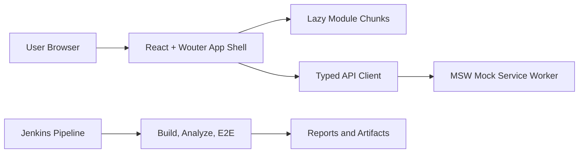

# Project Documentation

This folder documents the full implementation completed in this workspace: modular Wouter routing, lazy loading strategy, MSW mock APIs, enterprise optimization patterns, test coverage, and local Jenkins CI setup.

## Documentation map

- [Architecture (index)](architecture/README.md) — data layer, error handling, mock backend,
  testing, UI/styling — with mermaid diagrams. **Start here** to understand how the app works.
  - [Data Layer](architecture/data-layer.md)
  - [Error Handling & Notifications](architecture/error-handling.md)
  - [Mock Backend (@mswjs/data + faults)](architecture/mock-backend.md)
  - [Testing Strategy](architecture/testing-strategy.md)
  - [UI & Styling](architecture/ui-and-styling.md)
  - [Deployment & CI](architecture/deployment-and-ci.md) — GitHub Pages + Actions, base-path gotchas
- [Routing and Architecture](routing-and-architecture.md)
- [CI/Jenkins Runbook](ci-jenkins-runbook.md)
- [Implementation Differences](implementation-differences.md)
- [Frontend Optimization Guide](frontend-optimization-guide.md)
- [Optimization Foundations (Basics -> Advanced)](optimization-foundations/README.md)

## Quick start references

- App entry and route mounting: `src/App.tsx`
- App shell and navigation: `src/app/AppLayout.tsx`
- Active route matching helper: `src/shared/routing/ActiveLink.tsx`
- API contract (single source of truth): `src/shared/api/openapi.yaml` (`npm run codegen`)
- Data layer: `src/resources/*`, `src/shared/api/*`, `src/shared/query/*`
- Shared UI components: `src/shared/ui/*`
- Mock backend: `src/mocks/db.ts`, `src/mocks/seed.ts`, `src/mocks/handlers.ts`, `src/mocks/faults.ts`
- Pipeline: `Jenkinsfile`

## System overview

## Outcomes delivered

- Modular route ownership with nested/deep routes and redirects.
- Stable active-link logic for parent/child route edge-cases.
- Enterprise-style optimization examples with heavy dependency isolation.
- Playwright E2E coverage with CI-friendly reports.
- Jenkins pipeline for lint/build/budget/e2e with artifact publishing.
- Node version parity setup for local and Jenkins using `.nvmrc`.
