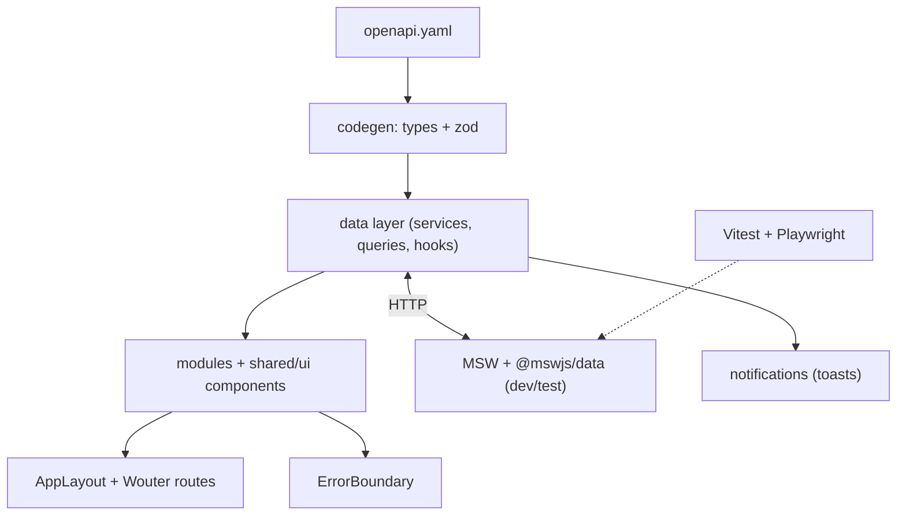

# Architecture

Deep-dives into how the app is built and why. Diagrams render on GitHub (mermaid).

- [Data Layer](./data-layer.md) — OpenAPI → types + zod → client → service → queryOptions →
  hooks → components; the request/validation/error sequence; singletons.
- [Error Handling & Notifications](./error-handling.md) — error boundaries, query/mutation
  errors, and the decoupled notification store.
- [Mock Backend](./mock-backend.md) — the `@mswjs/data` relational DB and runtime fault injection.
- [Testing Strategy](./testing-strategy.md) — the unit/component/e2e pyramid on shared MSW
  handlers; toolchain gotchas.
- [UI & Styling](./ui-and-styling.md) — shared components + CSS Modules; DRY & singletons recap.

## One-screen mental model

