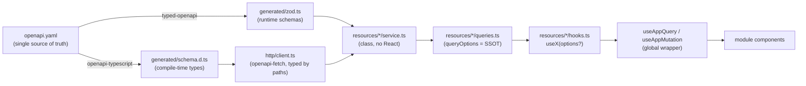
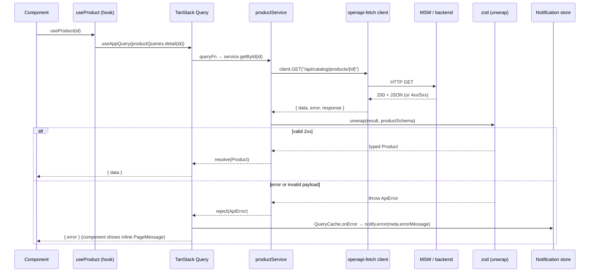

# Data Layer Architecture

How data flows from a single OpenAPI spec to React components, and why each layer exists.

## The single source of truth

`src/shared/api/openapi.yaml` is the **one** definition of the API. Two generators derive
from it via `npm run codegen`, so types and runtime validators can never drift:



## Layered request flow (happy + error)

A single read, end to end, including runtime validation and the error→toast path:



## Why each layer

| Layer | File(s) | Responsibility | Why separate |
|---|---|---|---|
| Spec | `openapi.yaml` | The contract | One place to change the API shape/constraints |
| Types | `generated/schema.d.ts` | Compile-time types | Auto-generated; zero hand-written drift |
| Validators | `generated/zod.ts` | Runtime schemas | Assert the untrusted response at the boundary |
| Client | `http/client.ts` | Typed transport + middleware (auth, request-id) | Cross-cutting concerns in one place |
| `unwrap` | `http/errors.ts` | HTTP result → value or `ApiError` | The one choke point; single error type |
| Service | `*/service.ts` | Imperative methods, no React | Usable in tests/loaders; client is injectable |
| queryOptions | `*/queries.ts` | Cache key + fetcher | SSOT shared by hooks **and** imperative prefetch |
| Hooks | `*/hooks.ts` | `useX(options?)` | Ergonomic, overridable per call |
| Wrapper | `query/useApp*.ts` | Pin `ApiError`, merge meta | Global seam; toasts handled centrally |

## Singletons (one instance each)

Deliberate single instances, imported everywhere:

- `apiClient` (`http/client.ts`) — one configured transport.
- `queryClient` (`query/queryClient.ts`) — one cache; `createAppQueryClient()` exists only
  so tests get isolated clients with identical behavior.
- `notificationStore` (`notifications/notificationStore.ts`) — one observable store, usable
  from outside React (the cache callbacks push into it).
- `productService`, `orderService`, … — one per resource (the class stays injectable/testable).

## Using it: hooks OR imperative

The same `queryOptions` builder powers both call styles:

```ts
// In a component:
const { data } = useProduct(id);

// Imperatively (router loader, hover prefetch, tests):
await queryClient.prefetchQuery(productQueries.detail(id));
const product = await productService.getById(id); // no React at all
```

See also: [error-handling.md](./error-handling.md), [testing-strategy.md](./testing-strategy.md).
