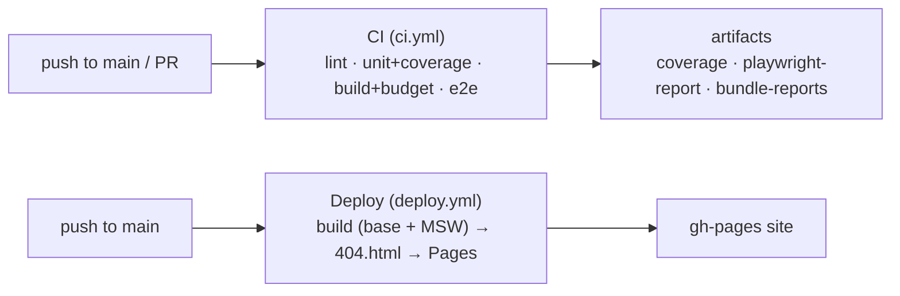

# Deployment & CI

Live demo: **https://singhamandeep007.github.io/wouter/**

Two GitHub Actions workflows:



## CI — `.github/workflows/ci.yml`

Runs on **push to main** and on **every pull request**, uploading artifacts (even on failure):

- `npm run lint`
- `npm run test:cov` → **coverage** artifact
- `npm run analyze && npm run budget:bundle` → **bundle-reports** (visualizer HTML + budget
  JSON; the budget also enforces the chart.js lazy-split guard)
- `npx playwright install --with-deps chromium` + `npm run test:e2e` → **playwright-report** +
  `test-results/` (JUnit) artifacts

## Deploy — `.github/workflows/deploy.yml`

Runs on **push to main** (and manual dispatch). Publishes to GitHub Pages (source = GitHub
Actions, enabled via the Pages API):

1. `npm ci`
2. Build with `VITE_BASE=/wouter/` and `VITE_ENABLE_MSW=true`
3. `cp dist/index.html dist/404.html` (SPA fallback)
4. `upload-pages-artifact` → `deploy-pages`

## Why a mock backend in production

The demo has no real server, so **MSW runs in the deployed build** (`VITE_ENABLE_MSW=true`) —
the same `@mswjs/data` backend used in dev/tests serves the API. This is what makes the live
demo functional without hosting anything.

## Base-path gotchas (all solved)

GitHub Pages serves the app under `/wouter/`, which touches several places. Each reads the
base back from `import.meta.env.BASE_URL` at runtime (so dev, tests, and Pages all work):

| Concern | Fix | File |
|---|---|---|
| Asset URLs | `base: process.env.VITE_BASE \|\| "/"` | `vite.config.ts` |
| Router under subpath | `<Router base={basePath}>` | `src/main.tsx` |
| Deep-link refresh | `404.html` = copy of `index.html` | `deploy.yml` |
| **MSW service-worker scope** | Worker served from base; API calls kept under base so they fall inside the worker's scope | `main.tsx`, `http/client.ts` |
| MSW handler matching | Handler paths prefixed with the base | `mocks/handlers.ts` |

> The service-worker one is the subtle bit: a worker at `/wouter/mockServiceWorker.js` is
> scoped to `/wouter/`, so it can't intercept root `/api/...` calls. The client therefore
> requests `/wouter/api/...` and the handlers match that prefix. Verified in a real browser
> against `vite preview --base /wouter/` (dashboard + nested KPI both load via MSW).

## Reproduce the deploy build locally

```bash
VITE_BASE=/wouter/ VITE_ENABLE_MSW=true npm run build
cp dist/index.html dist/404.html
VITE_BASE=/wouter/ npm run preview   # open http://localhost:4173/wouter/
```
