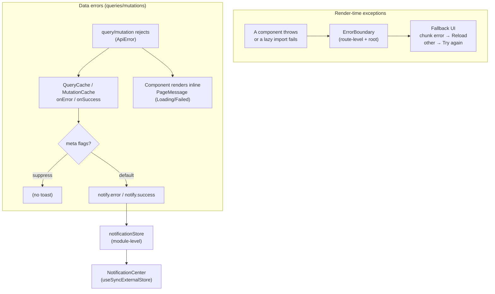

# Error Handling & Notifications

Three complementary layers catch three different kinds of failure. None overlaps.



## 1. Error boundaries — unexpected throws & failed imports

`src/shared/errors/ErrorBoundary.tsx` (a class — error lifecycles have no hook form):

- **Route-level** in `App.tsx` wraps `Suspense`, keyed `resetKeys={[location]}` so navigating
  away clears a broken route (otherwise the boundary stays errored forever).
- **Root-level** in `main.tsx` is the last-resort net around the whole app.
- **Chunk-load errors** (stale deploy: hashed chunk 404s) are detected by
  `isChunkLoadError` and offered a **Reload** (the only real fix) instead of a retry.

## 2. Query/mutation errors — the data layer

Handled centrally on the **caches**, not per component:

```ts
// queryClient.ts
new QueryCache({ onError(error, query) {
  if (query.meta?.suppressErrorNotification) return;
  notify.error(query.meta?.errorMessage ?? messageFromError(error));
}});
```

Why on the cache and not in each hook's `onError`: cache callbacks fire **once per cache
entry**, regardless of how many components observe the query, and don't double-fire under
StrictMode. Components still render their own inline `PageMessage` for the failed state; the
toast is the global signal. `meta` (typed in `query/meta.ts`) lets any query/mutation
customize or opt out of the toast declaratively.

## 3. Notifications — decoupled store

`notificationStore` is a module-level observable (not React context) precisely because the
cache callbacks run **outside** the React tree. `NotificationCenter` subscribes with
`useSyncExternalStore`. Auto-dismiss timers live in the store, so success/info toasts expire
on their own while errors stay until dismissed.

## One error type

`unwrap` (see [data-layer.md](./data-layer.md)) converts every HTTP failure — non-2xx,
network, and **schema-validation** failures — into a single `ApiError`. Registering
`defaultError: ApiError` with TanStack Query means every `error` in the app is that type, so
there is no `unknown` to narrow.
