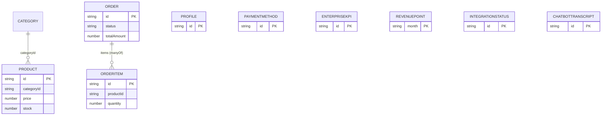
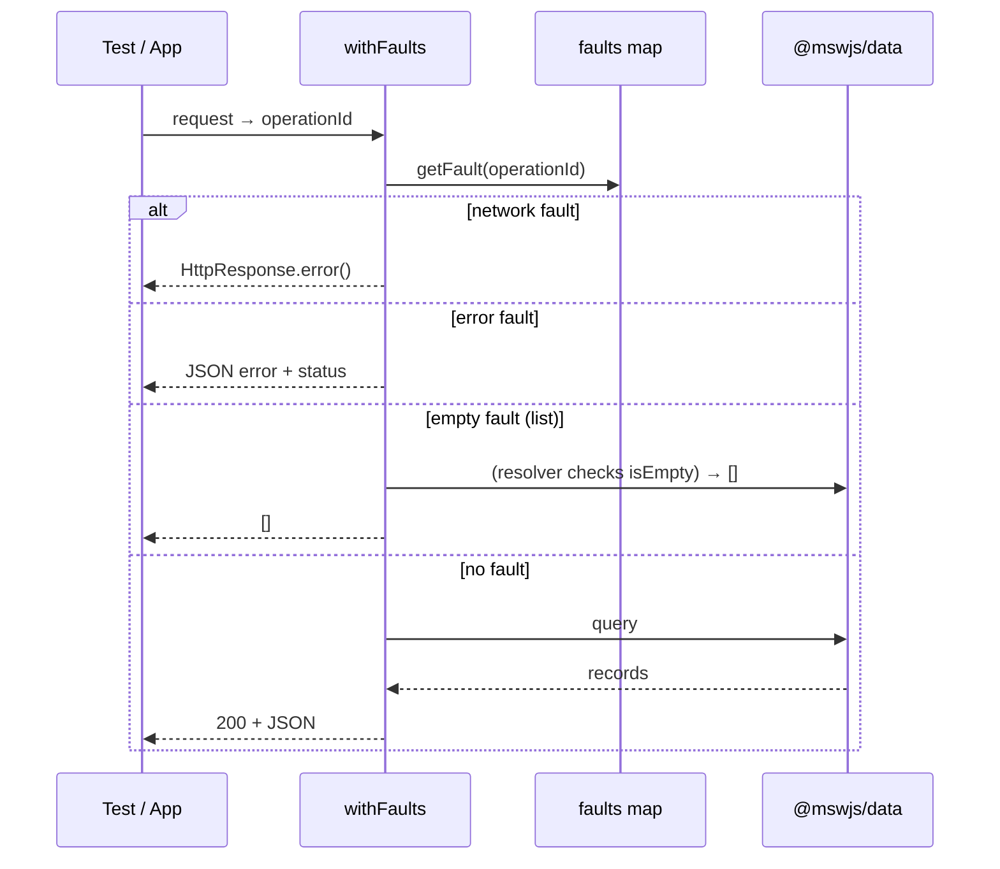

# Mock Backend (@mswjs/data + fault injection)

The mock backend behaves like a real one: a relational in-memory DB, queried by MSW
handlers, with runtime-controllable failure injection for tests.

## Relational model

`src/mocks/db.ts` defines the schema; `src/mocks/seed.ts` populates it.



Why a DB instead of static arrays: a real query API (`findFirst`/`getAll`/`update`),
referential integrity (an order owns its items), and persistence (a profile `PUT` sticks) —
so handlers stay thin and DRY. Primary keys reuse real fields (`id`, `month`) so serialized
records match the OpenAPI contract; `enterpriseKpi`'s synthetic `id` is stripped in the handler.

## Handlers query the DB, wrapped in a fault HOF

`src/mocks/handlers.ts` maps each `/api/...` path to a DB query, wrapped in
`withFaults(operationId, resolver)` from `src/mocks/faults.ts`. All failure behavior lives in
that one HOF — handlers only describe the happy path.



## Driving faults from tests

The control surface is exposed on `window.__mock` in mock/dev builds only (see `browser.ts`):

```ts
window.__mock.fail("getDashboardSummary", 500); // error
window.__mock.empty("listProducts");            // empty collection
window.__mock.network("getOrderById");          // transport failure
window.__mock.reset();                           // clear faults + reseed
```

- **Playwright** calls these via `page.evaluate` (helpers in `tests/e2e/support/mock.ts`).
  Because setting a fault then navigating in-app (SPA, no reload) keeps the fault active, the
  target route's first fetch hits it. See [testing-strategy.md](./testing-strategy.md).
- **Unit tests** import the same handlers into an MSW **node** server and use `server.use(...)`
  overrides; `test/setup.ts` reseeds the DB and clears faults between every test.
