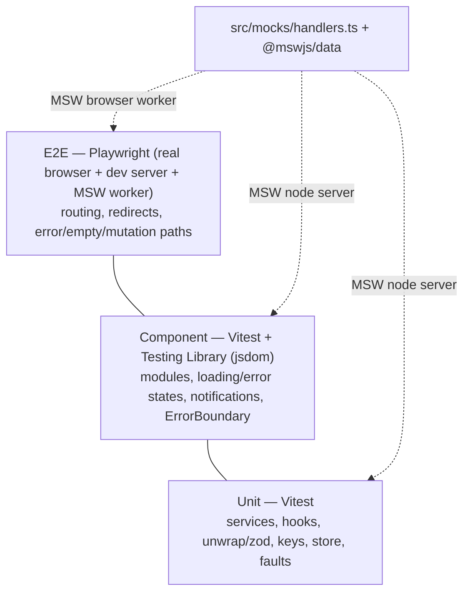

# Testing Strategy

A pyramid: many fast unit/component tests, fewer end-to-end tests. Both tiers exercise the
**same** MSW handlers and `@mswjs/data` backend, so they test the real request contract.

## Commands

| Command | What |
|---|---|
| `npm test` | Vitest unit + component (run once) |
| `npm run test:watch` | Vitest watch |
| `npm run test:cov` | Vitest + coverage (`src/shared/**`, `src/resources/**`) |
| `npm run test:e2e` | Playwright |

## Unit / component (Vitest, jsdom)

- `src/test/setup.ts` starts one MSW **node** server, reseeds the DB, and clears faults
  before every test — so mutations/faults never leak between tests.
- `src/test/test-utils.tsx` provides `renderWithProviders` (QueryClient + in-memory Wouter
  router) and `createQueryWrapper` (for `renderHook`).
- Error paths use `server.use(...)` to force a 4xx/5xx and assert the inline `PageMessage`
  and/or the error toast.

### Two toolchain gotchas (documented so they don't bite again)

1. **openapi-fetch captured `globalThis.fetch` at module load**, before MSW patched it —
   so requests bypassed interception. Fixed by **late-binding** fetch in `http/client.ts`
   (`fetch: (input) => globalThis.fetch(input)`).
2. **MSW resolves relative handler paths against jsdom's origin.** The test base URL must
   share that origin, so `vitest.config.ts` sets `jsdom.url` and `VITE_API_BASE_URL` to the
   same `http://localhost:3000`.

## E2E (Playwright)

- The dev server runs with the MSW **browser** worker (mocking enabled in DEV).
- Error/empty/network paths are injected via `window.__mock` (see
  [mock-backend.md](./mock-backend.md)). Pattern: boot on a data-free route (`/history`),
  set a fault, then navigate **in-app** so the fault applies to the first fetch. A full
  `page.goto` would reload and reset the fault.
- Active-nav assertions use `aria-current="page"` (stable + accessible), not CSS class names
  (which are now hashed CSS-Module classes).

## What's covered

- Every resource service + hook: happy path and error path (toast).
- `unwrap` validation (valid passes, malformed → `ApiError`), incl. spec-constraint violations.
- Notification store (timers, dedupe, dismiss) and the cache→notification wiring.
- ErrorBoundary (throw→fallback, chunk vs render, resetKeys, route integration).
- Fault infrastructure (`withFaults`, control) directly.
- E2E: routing/redirects/active-link + the error/empty/mutation journeys.
