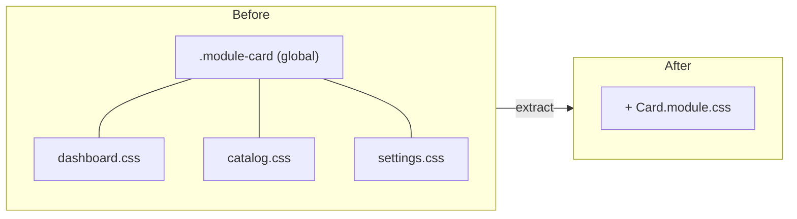

# UI Components & Styling

## Principle: shared UI is a component, not a shared class

The repo used to share styling through global CSS classes (`.module-card`, `.module-links`,
`.is-active`) reused across files via descendant selectors. That is not DRY and not scoped.
The React-idiomatic fix is a **reusable component** that owns its markup + styles, styled with
a **CSS Module** so class names are locally scoped (hashed) and can't collide.

## The shared components (`src/shared/ui/`)

| Component | Replaces | Notes |
|---|---|---|
| `Card` | `.module-card` + per-module descendant CSS | The panel every module renders in |
| `ModuleNav` | `.module-links` list of `ActiveLink`s | Feeds hashed classes to `ActiveLink`'s `className`/`activeClassName` |
| `PageMessage` | ad-hoc `
Loading…/Failed…
` | Standardizes text + a11y role (status/alert) + testid |
| `MetricGrid` / `MetricTile` | `.enterprise-grid` / `.enterprise-metric` | KPI grid |
| `FlowSurface` | `enterprise-flow.css` + `live-order-flow.css` | One bordered React-Flow container |
| `cx` | — | Tiny classnames helper (no dependency) |

## CSS Modules everywhere

- Each component imports `import styles from "./X.module.css"` and uses `styles.foo`.
  Vite types `*.module.css` via `vite/client` (no extra setup).
- The **only** global stylesheet is `src/index.css` — reset + base element styles + tokens.
- `AppLayout` uses `layout.module.css`; notifications and error boundary use their own modules.

## Active state is behavioral, not class-based

Because module class names are hashed, `ActiveLink` also sets `aria-current="page"` when
active. That is the stable, accessible signal the app and tests rely on — styling can change
freely without breaking anything. (The visual highlight is still applied via a module class.)

## DRY & singletons recap

- **DRY:** `Card`/`PageMessage`/`ModuleNav`/`FlowSurface`, the `withFaults` HOF, `cx`,
  `createQueryWrapper`, and the e2e `mock.ts` helpers each remove a class of duplication.
- **Singletons:** `apiClient`, `queryClient`, `notificationStore`, the mock `db`, and each
  `*Service` are single instances (see [data-layer.md](./data-layer.md)).
