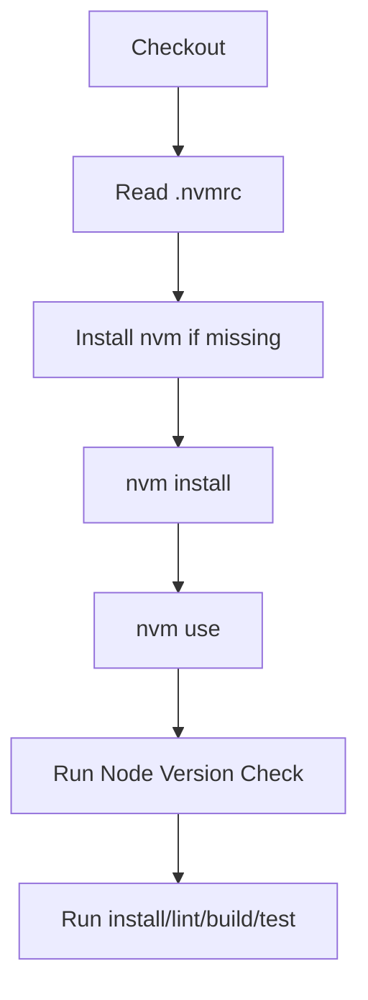

# CI/Jenkins Runbook

This runbook captures how Jenkins is configured for this repository, how Node versions are kept in sync with local development, and how to troubleshoot common local Jenkins issues.

## Pipeline stages

`Jenkinsfile` defines:

1. Checkout
2. Setup Node from `.nvmrc`
3. Node Version Check
4. Install (`npm ci`, Playwright browser)
5. Lint
6. Build + Analyze
7. Bundle Budget Gate
8. E2E
9. Post actions (JUnit + artifacts)

## Node version parity (local and Jenkins)

- Project source of truth: `.nvmrc`.
- `package.json` includes engines (`node` and `npm`) for contract clarity.
- Pipeline installs/uses the version from `.nvmrc` before all build tasks.

### Flow

## Artifacts and reports

Published in `post { always { ... } }`:

- `test-results/e2e-junit.xml`
- `dist/bundle-report.html`
- `dist/bundle-budget-report.json`
- `playwright-report/**`
- `test-results/**`

## Bundle budget policy

`scripts/check-bundle-budget.mjs` currently validates these required prefixes:

- `vendor-core-`
- `vendor-flow-`
- `vendor-analytics-`
- `index-` (app entry)

Current limit policy is `500 KiB` for both raw and gzip thresholds per tracked chunk.

## Local Jenkins setup notes

### Recommended job mode

- Pipeline from SCM
- Repository URL: `file:///Users/singhamandeep007/Developer/tutorials/wouter`
- Branch: `*/main`
- Script Path: `Jenkinsfile`

### Local Git checkout permission issue (common)

If Jenkins blocks local file-based git checkout, run Jenkins with JVM property:

`-Dhudson.plugins.git.GitSCM.ALLOW_LOCAL_CHECKOUT=true`

## Troubleshooting guide

### Build fails before install with Node mismatch

- Confirm `.nvmrc` version exists on agent.
- Check stage logs from `Setup Node from .nvmrc` and `Node Version Check`.

### Post step says reports/artifacts missing

- Ensure pipeline runs post steps in the same workspace context as build stages.
- Verify paths are relative to workspace root and files exist after E2E/build.

### API trigger returns HTTP 403

- Jenkins CSRF/auth is active.
- Use logged-in UI `Build Now` or API token + crumb for script triggers.

## Operational commands (local dev parity)

- Use project version locally: `nvm use`
- Validate versions: `node -v && npm -v`
- Run same CI path manually:
  - `npm ci`
  - `npm run lint`
  - `npm run analyze`
  - `npm run budget:bundle`
  - `npm run test:e2e:ci`
