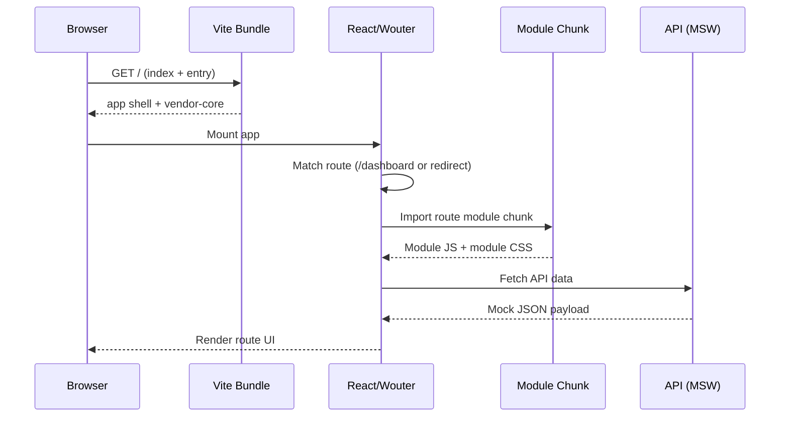
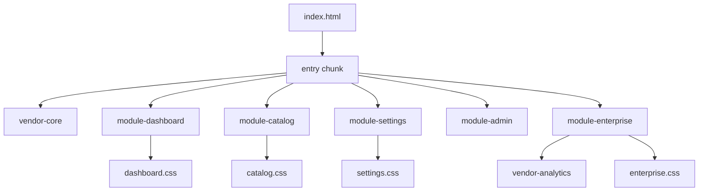

# Modern Frontend Optimization Guide (Enterprise Scale)

This project now includes enterprise-like complexity to demonstrate modern optimization patterns under real constraints: heavier dependencies, module-level routes, dynamic imports, chunk strategy, and API mocking.

## What was added to simulate a large business frontend

- Heavy runtime libraries: `chart.js`, `lodash-es`, `date-fns`, `zod`, `axios`
- New enterprise module with nested routes and default redirect:
  - `/enterprise` → `/enterprise/dashboard`
  - `/enterprise/analytics` (chart rendering via dynamic import)
  - `/enterprise/integrations` (dynamic `axios` loading)
  - `/enterprise/contracts` (runtime schema validation using `zod`)
- Additional mock APIs and larger data shapes in MSW
- Vite manual chunking strategy and optional bundle visualizer

## Optimization layers (how they work together)

### 1) Route-level code splitting (React + Wouter)

At app startup, only the shell + current route module load. Other modules remain separate chunks until navigation.

### 2) In-module dynamic imports

Even inside a route chunk, heavy features can be split further:

- `chart.js` loads only when `/enterprise/analytics` is opened
- `axios` loads only when `/enterprise/integrations` is opened

This avoids paying for heavy dependencies globally.

### 3) Bundler chunking (Vite/Rollup `manualChunks`)

`vite.config.ts` groups dependencies by concern:

- `vendor-core` (React + Wouter)
- `vendor-analytics` (chart/date/lodash/zod/axios)
- module-focused chunks (for enterprise/settings)

This improves long-term browser caching and reduces invalidation blast radius.

### 4) Asset + CSS chunking

Each lazy module imports its own CSS file. Vite emits module CSS chunks that load with the corresponding module JS.

## Under the hood: load lifecycle

## Under the hood: chunk graph (simplified)

## Example: why this matters in large apps

Without splitting, users download every module + heavy dependency on first load.

With layered splitting:

- Initial route gets faster time-to-interactive
- Feature teams can own module bundles independently
- Cache hit rates improve for stable vendor chunks
- Heavy libraries are paid only when needed

## Practical best practices

- Keep route modules coarse, feature modules fine.
- Move rarely-used heavy libs behind dynamic imports.
- Use `manualChunks` intentionally; avoid over-fragmentation.
- Keep shared critical path small (shell, navigation, auth, route matcher).
- Validate API contracts at boundaries (`zod`) but avoid validating large payloads repeatedly.
- Use stable test IDs for route/component-level performance and correctness checks.
- Analyze output regularly:
  - `npm run build`
  - `npm run analyze` and inspect `dist/bundle-report.html`

## Common anti-patterns

- Importing analytics/charting libs at app root.
- Huge shared utility barrel that drags everything into initial chunk.
- Too many tiny chunks causing request overhead.
- No cache strategy (frequent invalidation of all vendor code).
- Route components that trigger duplicate data fetching on every render.

## Suggested next experiments

1. Add prefetching on sidebar hover for likely next routes.
2. Add runtime performance marks around route transitions.
3. Add Web Vitals reporting and correlate with chunk changes.
4. Introduce service-worker caching policies for static chunks.
5. Compare bundle report before/after each optimization.
