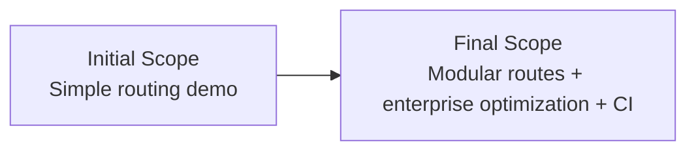
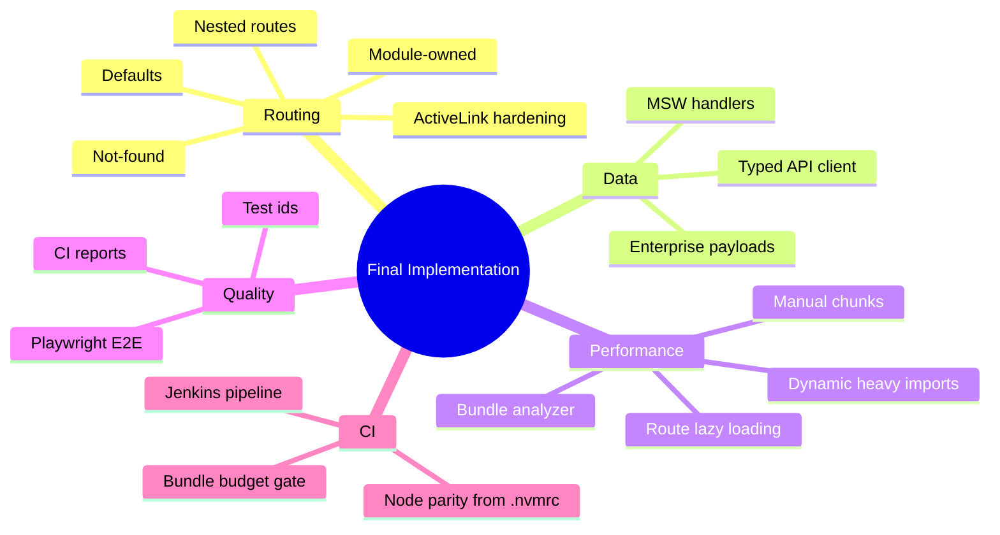

# Implementation Differences (Baseline vs Final)

This document summarizes the major differences between the initial lightweight demo intent and the final implementation delivered in this workspace.

## High-level delta

## 1) Routing model

### Baseline

- Basic route mapping at app level.
- Minimal nested routing.

### Final

- Module-owned routing by feature.
- Deep nested sub-routing (`settings/orders/...`).
- Explicit parent defaults and redirects.
- Module-level + global not-found handling.
- Active-link edge-case handling for deep routes.

## 2) Loading strategy

### Baseline

- Typical route component loading.

### Final

- Route-level lazy loading for modules.
- Module CSS chunk loading.
- Extra dynamic imports inside enterprise module for heavy dependencies.

## 3) API/data layer

### Baseline

- Minimal static/mock data expectation.

### Final

- MSW-backed realistic mock endpoints.
- Shared typed API contracts.
- Expanded data shape for enterprise examples.

## 4) Testing

### Baseline

- Manual verification expectation.

### Final

- Playwright E2E suite with stable `data-testid` selectors.
- Coverage for redirects, active-route correctness, deep routes, and not-found behavior.
- CI-compatible JUnit + HTML report outputs.

## 5) Build optimization

### Baseline

- Standard Vite output.

### Final

- `manualChunks` strategy in Vite.
- Bundle analyzer report generation.
- Bundle budget gate script in CI.

## 6) CI/CD and ops

### Baseline

- No pipeline expectation.

### Final

- Jenkins declarative pipeline with lint/build/analyze/budget/e2e.
- Artifact archiving + test report publishing.
- Node version parity enforcement via `.nvmrc` + Jenkins setup stage.

## Final capability map

## Related docs

- [Routing and Architecture](routing-and-architecture.md)
- [CI/Jenkins Runbook](ci-jenkins-runbook.md)
- [Frontend Optimization Guide](frontend-optimization-guide.md)
