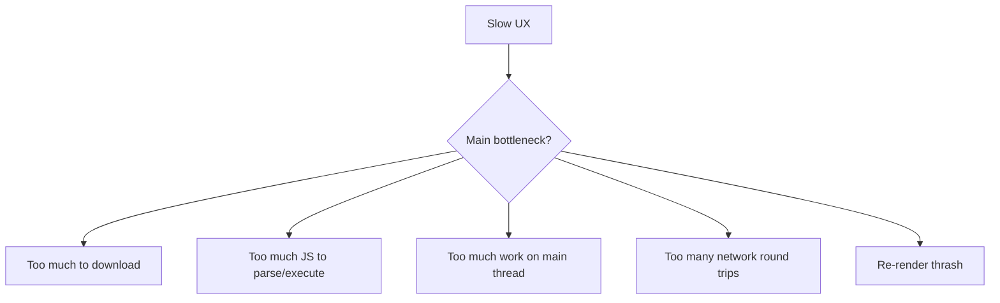

# 01) Basics: Performance Model for Frontend Apps

Before techniques, understand what users feel:

- **Initial load speed**: how fast the first meaningful screen appears.
- **Interactivity speed**: how quickly the app reacts after first paint.
- **Navigation speed**: how fast route-to-route transitions happen.
- **Runtime smoothness**: how stable/lag-free interactions are.

## Core bottlenecks

## Why large business frontends get slow

- Many teams add dependencies independently.
- Shared shells accumulate global imports.
- Features are bundled into initial load accidentally.
- Route transitions trigger unnecessary data+render work.
- Caching invalidates too much when one area changes.

## The optimization stack (from foundation to advanced)

1. **Measure first**: bundle reports, route timings, Web Vitals.
2. **Trim baseline**: remove dead code and heavy eager imports.
3. **Split smartly**: route/module/vendor boundaries.
4. **Load on demand**: lazy routes + dynamic imports.
5. **Optimize network**: caching headers, prefetch hints.
6. **Optimize runtime**: avoid expensive render/compute paths.

## Key concepts and differences

- **Code splitting**: generating multiple output bundles at build-time.
- **Chunking**: how those bundles are grouped by bundler strategy.
- **Lazy loading**: deferring module loading until runtime condition.
- **Dynamic import**: JavaScript primitive (`import()`) that enables runtime loading.
- **Asset optimization**: optimizing CSS/fonts/images/media delivery.

## Rule of thumb

- Optimize for the **critical path** first.
- Do not globally optimize everything at once.
- In enterprise apps, the biggest win is usually reducing what ships on the first route.

## Current app example (mapped to basics)

### Critical path in this app

At startup, the browser loads the app entry and core runtime first, then route chunks on demand.

- Entry: `dist/assets/index-*.js`
- Core shared runtime: `dist/assets/vendor-core-*.js`
- Route chunks lazy-loaded from router-level `lazy(() => import(...))` in `src/App.tsx`

### Why this matters here

If all modules were eagerly imported in `src/App.tsx`, first-load would include dashboard/catalog/settings/admin/enterprise/history code and their transitive dependencies.

Current setup avoids that by loading module chunks only when route matches.

### Quick baseline numbers from this build

- `app-entry` (`index-*.js`): ~5.5 KB raw / ~1.9 KB gzip
- `vendor-core`: ~194.5 KB raw / ~61.8 KB gzip
- `vendor-flow`: ~173.2 KB raw / ~55.9 KB gzip (loaded only on flow routes)
- `vendor-analytics`: ~322.1 KB raw / ~107.8 KB gzip (primarily enterprise-oriented)

Use these as reference points when measuring optimization impact.
