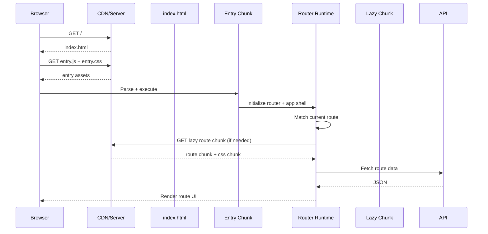
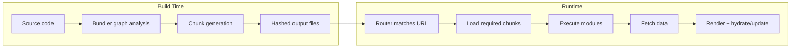

# 02) Under the Hood: What Happens When a User Opens Your App

This section explains exactly how splitting/lazy loading/chunking cooperate at runtime.

## Startup lifecycle

## Build-time vs Runtime responsibilities

- **Bundler (Vite/Rollup/Webpack)** decides chunk boundaries and output files.
- **Router + React runtime** decide *when* chunks are requested.
- **HTTP cache** decides whether files come from network or local cache.

## Where each optimization acts

- Vendor splitting: build-time chunk composition.
- Route-level lazy loading: runtime module request timing.
- Dynamic imports inside module: runtime sub-feature timing.
- Asset chunking: build-time output + runtime CSS/image fetch order.
- Prefetch/preload: runtime/network scheduling hints.

## Common misunderstanding to avoid

"I enabled lazy loading so performance is solved" is incomplete.

Lazy loading can reduce initial JS, but if chunk boundaries are poor or shared deps are duplicated, total cost can still remain high.

## Current app under-the-hood trace (real build artifacts)

### 1) Router-level lazy boundaries originate in source

In `src/App.tsx`, route modules are declared with React lazy imports:

- `lazy(() => import("./modules/settings/SettingsModule"))`
- `lazy(() => import("./modules/enterprise/EnterpriseModule"))`
- and similar for other modules.

### 2) Bundler rewrites those into runtime chunk loaders

In `dist/assets/index-*.js`, those become dynamic loaders such as:

- `import("./SettingsModule-*.js")`
- `import("./EnterpriseModule-*.js")`

The same file also contains `__vite__mapDeps(...)` which preloads dependent assets (including CSS chunks) needed by that module.

### 3) Route chunks and shared vendor chunks are connected at runtime

Generated output shows route chunks pulling shared vendor groups when needed:

- `EnterpriseModule-*.js` requests `vendor-flow-*.js` and `vendor-analytics-*.js` for flow/analytics-heavy routes.
- `OrdersSubRouter-*.js` requests `vendor-flow-*.js` for `/settings/orders/live`.

So one shared flow runtime is downloaded once and reused across both settings and enterprise flow routes.

### 4) In-feature dynamic imports add deeper deferral

Inside enterprise route code, there are additional runtime imports for optional-heavy operations:

- chart path loads `auto-*.js` (chart.js bundle) only when analytics view runs.
- integrations path loads `axios-*.js` only when integration transcript logic runs.

This is runtime-on-runtime splitting: route chunk first, heavy sub-feature second.
