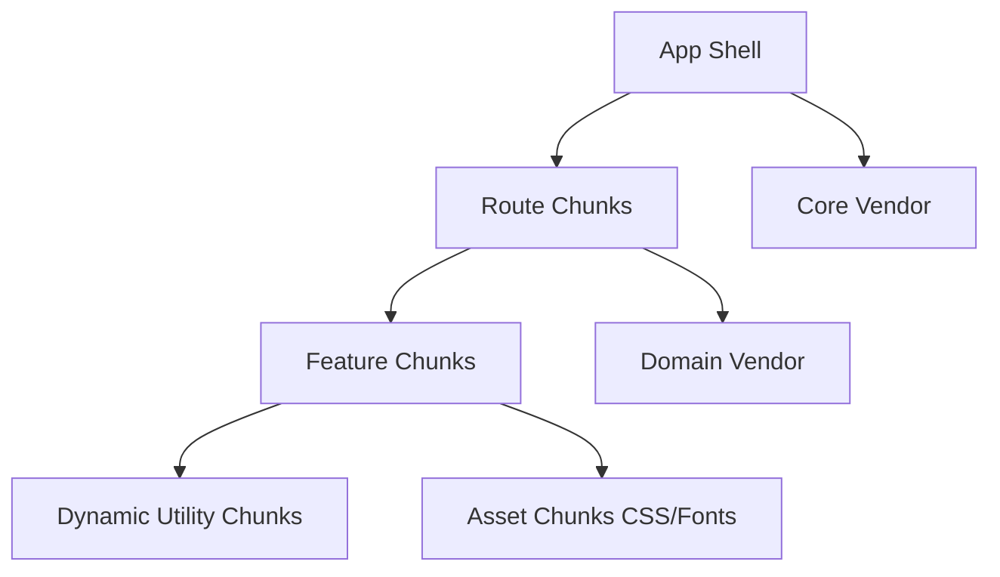
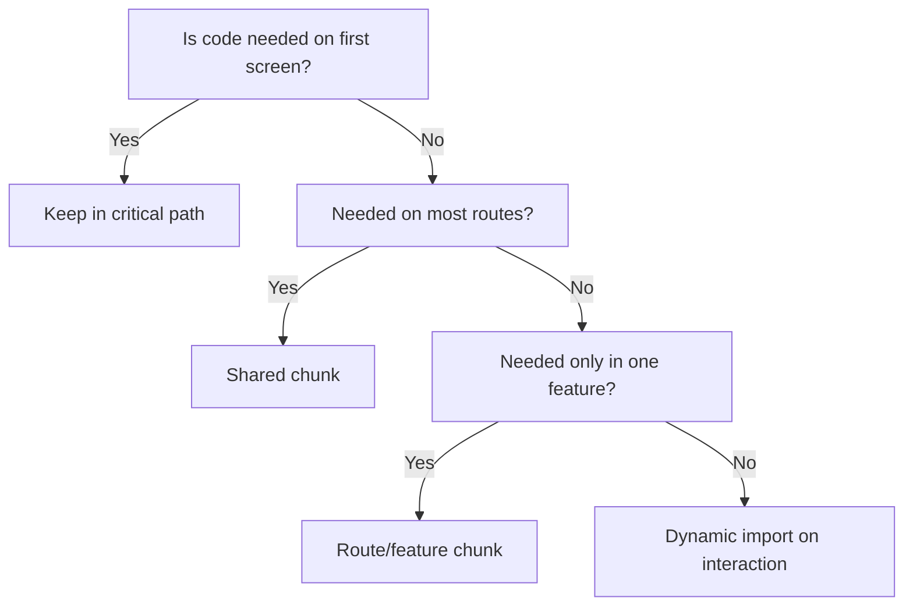
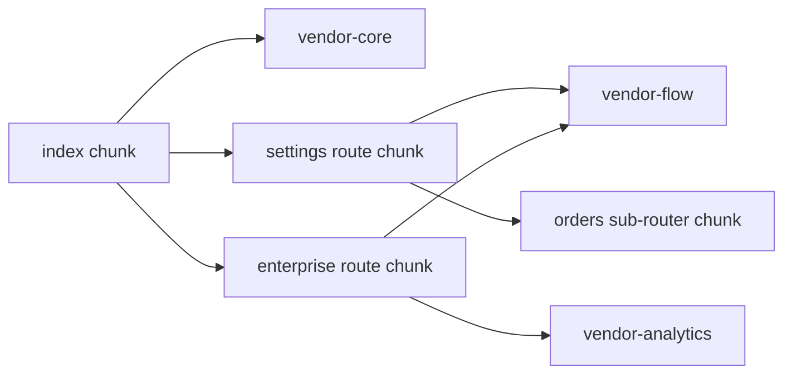

# 03) Splitting and Chunking Strategies (and Trade-offs)

Large apps need a predictable strategy, not ad-hoc imports.

> **Update — chart.js lazy-load fix.** `manualChunks` originally grouped `chart.js` into
> `vendor-analytics`, which a lazily-loaded module also imported statically — collapsing the
> deliberate `import("chart.js/auto")` back into an eager load. chart.js is now left out of
> `manualChunks` so it gets its own async chunk (loaded only when the analytics tab mounts):
> `vendor-analytics` dropped ~285 KB → ~82 KB, and ~200 KB of chart.js now loads on demand.
> A guard in `scripts/check-bundle-budget.mjs` fails CI if chart.js leaks back into an eager
> chunk. **Lesson:** `manualChunks` is a *placement* directive; assigning a lib to a chunk an
> eager module already imports makes it eager, regardless of `import()` in your source.

## Strategy layers

## 1) Route-level splitting

Use lazy route modules so first load ships only shell + current route.

Best when:
- Feature areas are mostly independent.
- Users visit a subset of routes per session.

Trade-off:
- First visit to each route may have loading delay.

## 2) Vendor splitting

Group third-party libs intentionally (for example: core UI/router vs analytics/charts).

Best when:
- Core vendor changes rarely.
- Heavy optional vendor libs are not needed for every route.

Trade-off:
- Over-fragmentation can increase requests and overhead.

## 3) In-route dynamic imports

Inside a loaded route, defer expensive sub-features (charts/editors/export tools) until needed.

Best when:
- Feature has optional tabs/panels/actions.

Trade-off:
- User can see micro-delay at interaction time.

## 4) CSS and asset chunking

Keep module CSS with module JS. Optimize images/fonts by size and format.

Best when:
- Product has highly distinct sections.

Trade-off:
- Too many tiny CSS chunks can create style-pop if loading strategy is poor.

## Practical decision tree

## Enterprise chunk governance model

- Define chunk ownership by domain team.
- Maintain chunk size budgets in CI.
- Audit top routes monthly for regressions.
- Keep long-term cache keys stable for core chunks.
- Review new dependencies with impact estimate.

## Current app mapping (source -> chunk -> runtime)

### Manual chunk policy in this repo

`vite.config.ts` currently applies these rules:

- `react*` + `wouter` -> `vendor-core` (includes `react-dom` implicitly because path contains `node_modules/react`)
- `@xyflow/*` + graph ecosystem paths -> `vendor-flow`
- `chart.js`, `lodash-es`, `date-fns`, `zod`, `axios` -> `vendor-analytics`

Route modules are not manually forced into a single module chunk.

### What was generated

From `dist/assets`:

- `vendor-core-*.js`
- `vendor-flow-*.js`
- `vendor-analytics-*.js`
- route chunks such as `EnterpriseModule-*.js`, `SettingsModule-*.js`, `OrdersSubRouter-*.js`

Also generated separate CSS chunks:

- `vendor-flow-*.css` for flow library styles
- feature css like `EnterpriseModule-*.css`, `OrdersSubRouter-*.css`

### Why use a dedicated `vendor-flow`

- React Flow is used in at least two separate feature routes (`/settings/orders/live`, `/enterprise/workflow`).
- We want one shared payload reused by both, not duplicated code in both route chunks.
- We also do not want all users to pay this cost at first load.

### Why these explicit matchers exist

In `vite.config.ts`, we intentionally include:

- `id.includes("node_modules/reactflow")`
- `id.includes("node_modules/d3-")`

Reason:

1. `reactflow` matcher is a compatibility guard for ecosystem/path variations (current package is `@xyflow/react`, but matching `reactflow` protects against alias/legacy style imports).
2. `d3-` matcher captures React Flow transitive graph dependencies (`d3-selection`, `d3-zoom`, `d3-drag`, etc.) so they stay grouped with flow runtime.
3. This improves deterministic chunk topology and cache behavior; otherwise some transitive deps can drift into unrelated shared chunks as dependency graphs evolve.

So this is not strictly required for correctness, but useful for predictable performance boundaries.

### Why avoid forcing `module-enterprise` / `module-settings` manual chunks

- Forced module chunks can accidentally become shared dependencies and load earlier than intended.
- Letting route chunks split naturally keeps ownership clean and prevents over-coupling between modules.
- Shared vendor groups should be explicit; feature code should stay near feature routes.

### Net strategy

This project uses **layered boundaries**:

1. Core vendor for always-needed framework/runtime.
2. Shared optional vendor groups (`vendor-flow`, `vendor-analytics`) for heavy ecosystems.
3. Route chunks for feature domains.
4. In-module dynamic imports for optional expensive sub-features.

That layered model is usually more stable at scale than one giant vendor chunk or too many tiny arbitrary chunks.

## Diagram: current strategy

