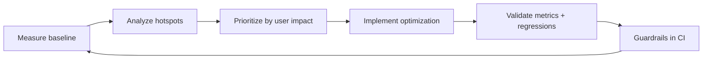
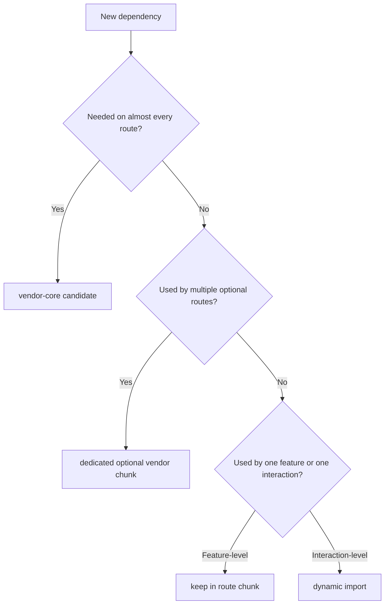

# 04) Enterprise Best Practices Playbook

Use this as a practical operating model in huge frontend organizations.

## Performance goals framework

Define targets per route class:

- Public landing routes
- Authenticated dashboard routes
- Heavy workflow routes (analytics/admin)

Example dimensions:
- JS transferred on first load
- Route transition time
- Long tasks count
- Cache hit ratio for vendor chunks

## End-to-end optimization lifecycle

## Best practices by layer

### Architecture

- Keep app shell minimal and stable.
- Push feature logic behind route boundaries.
- Avoid giant shared utility barrels.

### Build pipeline

- Use bundle analyzer in every release cycle.
- Enforce budget gates in CI.
- Track chunk drift over time, not just one build.

### Runtime loading

- Use route lazy loading by default.
- Add dynamic imports for heavy optional feature paths.
- Add prefetch only for likely next navigation, not globally.

### Data and rendering

- Co-locate data fetching with route boundary.
- Avoid duplicate fetches on remount.
- Prevent expensive list re-renders via memoization/windowing.

### Asset delivery

- Serve modern image formats with responsive sizing.
- Self-host critical fonts and reduce variants.
- Keep non-critical assets deferred.

## Anti-pattern checklist

- Heavy dependency imported in root layout.
- One mega vendor chunk with low cache reuse.
- Thousands of tiny chunks causing network overhead.
- Optimizing without measuring route-level impact.
- Ignoring third-party script cost.

## How this project maps to those practices

- Route module lazy loading already implemented.
- Heavy enterprise libs isolated behind route/dynamic boundaries.
- Manual chunk strategy exists in bundler config.
- CI includes budget gate and E2E checks.

## Current app evidence and interpretation

### Current chunk topology (from recent builds)

- `vendor-core` for framework/router runtime
- `vendor-flow` for React Flow ecosystem used by multiple feature routes
- `vendor-analytics` for heavy analytics/data libs
- route chunks (`SettingsModule`, `OrdersSubRouter`, `EnterpriseModule`, etc.) split by route boundaries

### Why this pattern is strong for enterprise apps

1. **Traffic segmentation**
  - Not every user opens flow-heavy or analytics-heavy routes.
  - Optional vendor groups keep those costs out of universal startup path.

2. **Change isolation**
  - `vendor-core` can stay stable while flow/analytics evolve independently.
  - Cache invalidation blast radius is reduced by concern-based chunking.

3. **Ownership boundaries**
  - Teams can reason about route chunk impact and shared vendor impact separately.
  - Easier to enforce budgets per chunk class (core/flow/analytics/route).

4. **Composability with deeper lazy imports**
  - Route-level lazy loading controls feature boundaries.
  - In-route dynamic imports still defer expensive optional paths.

### Strategy heuristic you can reuse

Chunk by **domain + usage frequency + dependency weight**:

- Framework/runtime needed everywhere -> shared core vendor chunk.
- Heavy ecosystem used by multiple optional routes -> dedicated shared vendor chunk.
- Feature code tied to route ownership -> route chunk.
- Expensive optional sub-flow inside feature -> dynamic import in feature.

## Diagram: practical decision path

## Suggested next steps for deeper mastery

1. Add route transition timing instrumentation.
2. Add prefetch strategy experiments (hover vs viewport).
3. Add Web Vitals dashboard and release correlation.
4. Run synthetic + real-user monitoring side-by-side.
5. Define performance SLAs per feature team.
