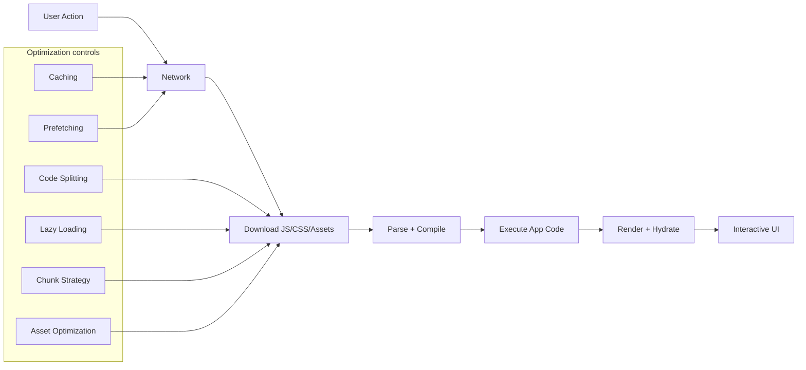

# Frontend Optimization Foundations (Large Business Apps)

This folder is a fundamentals-first learning path for modern frontend optimization in large products.

If the existing [../frontend-optimization-guide.md](../frontend-optimization-guide.md) feels advanced, start here.

## Learning path

1. [01-basics-performance-model.md](01-basics-performance-model.md)
2. [02-under-the-hood-loading-pipeline.md](02-under-the-hood-loading-pipeline.md)
3. [03-splitting-and-chunking-strategies.md](03-splitting-and-chunking-strategies.md)
4. [04-enterprise-best-practices-playbook.md](04-enterprise-best-practices-playbook.md)

## Mental model in one diagram

## What this teaches

- What each optimization layer does, and where it applies.
- How bundler splitting differs from runtime lazy loading.
- Why chunk boundaries affect caching and team velocity.
- How to choose trade-offs in huge multi-team frontends.
- How to measure impact (not just apply techniques blindly).

## Current app snapshot (real evidence)

From this repository's current build output (`dist/assets`):

- `vendor-core-*.js` (~194.5 KB raw, ~61.8 KB gzip)
- `vendor-flow-*.js` (~173.2 KB raw, ~55.9 KB gzip)
- `vendor-analytics-*.js` (~322.1 KB raw, ~107.8 KB gzip)
- route chunks (for example `SettingsModule-*.js`, `OrdersSubRouter-*.js`, `EnterpriseModule-*.js`)
- `index-*.js` (~5.5 KB raw, ~1.9 KB gzip entry)

Those numbers come from `dist/bundle-budget-report.json` and are useful as your baseline before any new optimization experiment.
