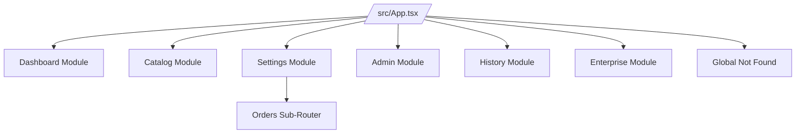
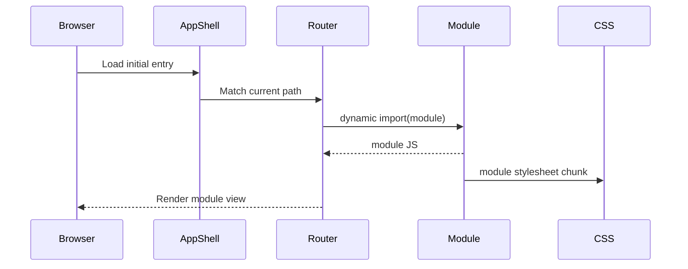

# Routing and Architecture

This project uses module-owned routing with Wouter. Top-level app wiring is minimal; each feature module owns its own nested paths and defaults.

## Design principles

- Keep route responsibility close to module UI.
- Prefer lazy route modules to reduce initial payload.
- Use explicit default redirects for parent paths.
- Handle not-found at both module and global levels.
- Keep active-link behavior deterministic for deep routes.

## Route ownership model

## Key behavior implemented

### Defaults and redirects

- `/` always redirects to `/dashboard`.
- Parent routes redirect to canonical defaults where applicable:
  - `/admin` -> `/admin/api`
  - `/enterprise` -> `/enterprise/dashboard`

### Nested/deep paths

- Catalog deep examples:
  - `/catalog/category/:slug`
  - `/catalog/product/:id`
- Settings deep examples:
  - `/settings/orders/:orderId`
  - `/settings/orders/:orderId/items/:itemId`
  - `/settings/orders/live`
- Enterprise deep examples:
  - `/enterprise/workflow`

### Not-found behavior

- Module-level not-found pages are shown for unknown child routes.
- Global not-found catches unknown app routes.

### Active-link matching

`src/shared/routing/ActiveLink.tsx` centralizes active state logic and normalizes paths to avoid false positives from:

- query strings
- hash fragments
- trailing slash variants

## Lazy-loading architecture

## Module inventory

- Dashboard: quick overview page.
- Catalog: list/category/product nested routes.
- Settings: profile/security + orders sub-router + live order flow visualization.
- Admin: API/chatbot pages and parent default.
- History: browser navigation behavior demo.
- Enterprise: dashboard/analytics/integrations/contracts/workflow with dynamic heavy deps.

## Testability decisions

- Added stable `data-testid` attributes for nav and route assertions.
- Added Playwright coverage for:
  - root redirect behavior
  - active-link edge cases
  - deep nested route correctness
  - module/global not-found output
